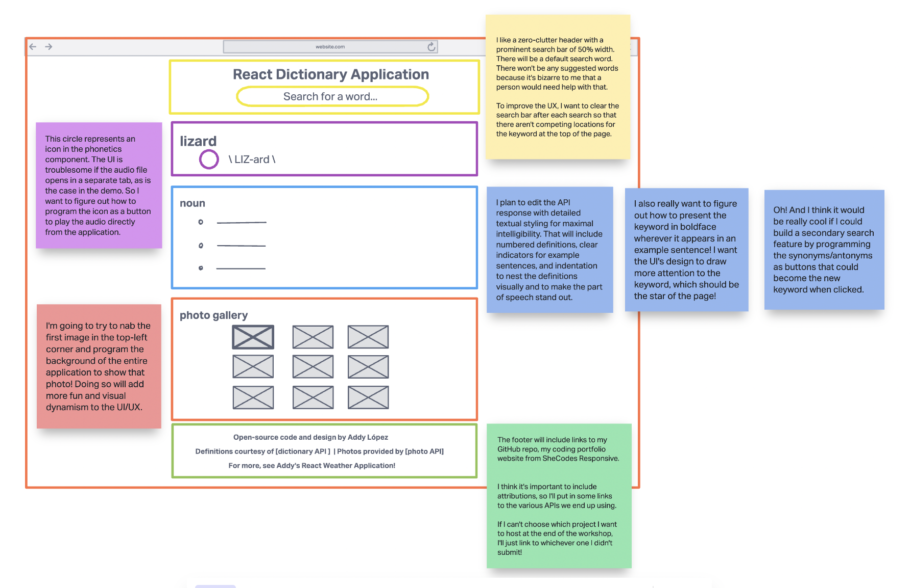
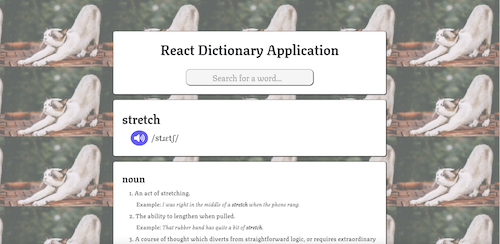

# React Dictionary Application

**_View this project:_** [https://imaginative-unicorn-d2aba6.netlify.app/](https://imaginative-unicorn-d2aba6.netlify.app/)

## Description

Student project for SheCodes React coding workshop.

**_Learning objective:_** To create a dictionary application using React. This application integrates with a dictionary API and the Pexels API to display images based on the word submitted.

## Baseline Features

- Built entirely in React (using techniques such as props, state managment, hooks, JS closures, events, loops, conditional rendering)

- Well-organized React components with discrete purposes that would be easy to discern for developers who had never seen my code

- Clean JSX using semantic HTML tags (conscientiously coded with accessibility concerns, SEO, legibility, and maintainability in mind)

- Responsive CSS, with extensive testing for devices of all sizes (in both portrait and landscape modes) using the toggle device toolbar in Google Chrome's DevTools

- Bootstrap grid

- Integration with the Free Dictionary API (for the definitions) and the Pexels API (for the images) using AJAX

- Use of the terminal, Node.js, and NPM

- Prototyping in the browser and debugging with Google Chrome's DevTools and React extension.

- Use of accessibility tools included in Google Chrome's DevTools, to ensure sufficient contrast ratios on par with the standard Web Content Accessibility Guidelines.

- Accessibility rating by Lighthouse audit: 91/100 for desktop, 91/100 for mobile devices

- Professional product development planning, using InVision's whiteboarding tool to design a wireframe (see below) prior to coding

- Coded in VS Code using professional development workflow tools, such GitHub Desktop, and processes, such as continuous deployment, with hosting on Netlify

- A polished README using Markdown

## Special Features I Designed

- Dynamic, data-driven interface. Rather than displaying a static image in the background, I programmed the application to display a mosaic background of the first photo returned from the Pexels API for any given search by the user. If the term submitted is searchable--that is, valid--for the Pexels API, the background image will be re-rendered based on the term submitted without refreshing the page. This feature is also integrated with searchable synonyms or antonyms generated by the Free Dictionary API that appear in some entries (read more below). If the term is not valid, the background image of the previous term will persist; however, this issue is minor and fixing it would require a more comprehensive database, which is the responsibility of the developer who created the API.

- Audio icons for React from the Font Awesome library programmed with audio clips of the phonetics using Howler JS, which I discovered and learned how to use independently for an improved UI/UX. The advantages of this method are a clean design and a seamless user experience, with the clip playing from the same page without interference. By contrast, my instructor's demo (see below) of this project did not use Howler JS to program an audio icon; instead, it opened the mp3 file in a separate tab, an experience which I consider both cumbersome and pesky to users.

- Detailed textual styling for maximal intelligibility, including proper numerical indices for each definition, clear indications of and partitions for each part of speech, differentiation between definitions and example sentences, consistent indentations, and keyword emphasis (learn more below)

- More about keyword emphasis: Whenever a word is searched, wherever it appears in an example sentence, it is rendered in boldface. This is a special and complicated feature that I designed on my own to lend greater star power to the search word. My code accounts for most instances of the keyword: when it is capitalized, when it appears more than once in an example sentence, and when it is used in a different verb tense. The exception is when the verb tense transforms the root form of the word.

- Synonyms and antonyms styled as buttons that will conduct a new search upon a double-click. Here is another experimental feature I built that enables a re-rendering of the page without refreshing it. The newly rendered page will display the search results for the related term that was double-clicked upon, given that the term is searchable, or valid, in the Free Dictionary API. If the search term is a valid term for the Pexels API, the background image will also be updated.

- The synonyms and antonyms are also given complementary styles, with the background color for one serving as the font color for the other and vice versa. This facet of the design gives the user an intuitive visual indication of the synonyms' and antonyms' opposing roles and invites the user not to treat them as static text but to interact with them as buttons.

- Informed typography. The chosen font, imported from the Google Fonts library, suggests the Gothic aesthetic character of a medieval manuscript. It is appropriate for a dictionary application because the carefully rendered serifs indicate respect--if not reverence--for the written word. Each letter of this font conveys the dignity and authority of print that one expects of a dictionary, without sacrificing legibility to ostentatious flourishes characteristic of other serif fonts. Legibility further aided by a half-pixel of added spacing between letters. A different but well-paired font is used for the phonetics to ensure that all special characters will be rendered to all users for any word searched.

## Wireframe

Created using InVision, a whiteboarding tool useful for planning product design.

## Preview

## Attributions

**_For comparison:_** Design inspired by the SheCodes React demo: [https://www.dictionary.shecodes.io/](https://www.dictionary.shecodes.io/)

**_Free Dictionary API:_** [https://github.com/meetDeveloper/freeDictionaryAPI](https://github.com/meetDeveloper/freeDictionaryAPI)

**_Pexels API:_** [https://www.pexels.com/api/](https://www.pexels.com/api/)
